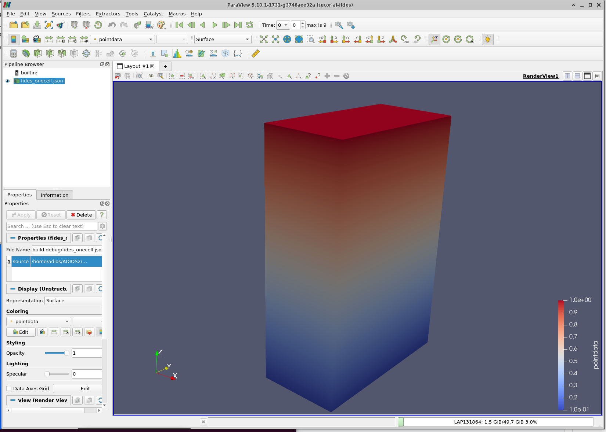
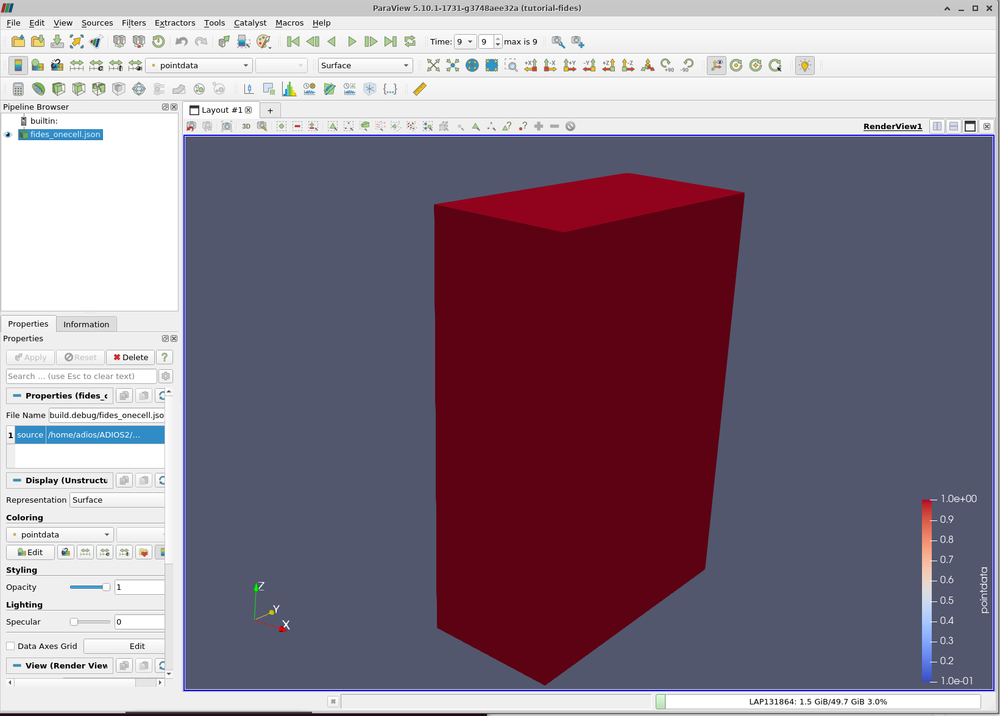

### Single cell example for visualization with Fides schema in ParaView

This example writes 8 points in 3D space, the corners of a box, and then defines a single hexagon cell of those eight
points. The coordinates of the points are stored in three 1D arrays, separating the X-Y-Z coordinates.

The cell is the enumeration of the points connected in the order of a hexagon prescribed by VTK, see
Figure 19-20 in the [VTK User Guide](https://vtk.org/wp-content/uploads/2021/08/VTKUsersGuide.pdf), type VTK_HEXAHEDRON
in page 480 (page 494 in the PDF).

The fides visualization schema is described in the fidesOneCell.json file can be
found [here](https://fides.readthedocs.io/en/latest/schema/schema.html).

We compose the coordinate system as a composite of the three 1D arrays for X, Y and Z coordinates. This is just an
enumeration of the N points in space (N = size of X = size of Y = size of Z) , in contrast to other examples where X, Y,
Z is combined to specify a structured grid (number of points = size of X * size of Y * size of Z).

In ParaView, one opens the fidesOneCell.json file and adds an property "source" with the value of the full path of the
onecell.bp. See left-middle Properties box in the ParaView window in the image paraview-onecell-step0.png. Then hit
Apply button and a gray box should appear (the single cell visualized). which can be rotated on screen. Then one must
color the box with the data ("pointdata") to get the pictures shown in the included images.

Note that the dataset over the points is called "DataOnPoints" in the onecell.bp file, but it is called "pointdata" in
the Fides schema to demonstrate which name is which (ParaView presents pointdata to the user while reading the
DataOnPoints array from the file).

First step of onecell.bp in ParaView:

Last step of onecell.bp in ParaView:

