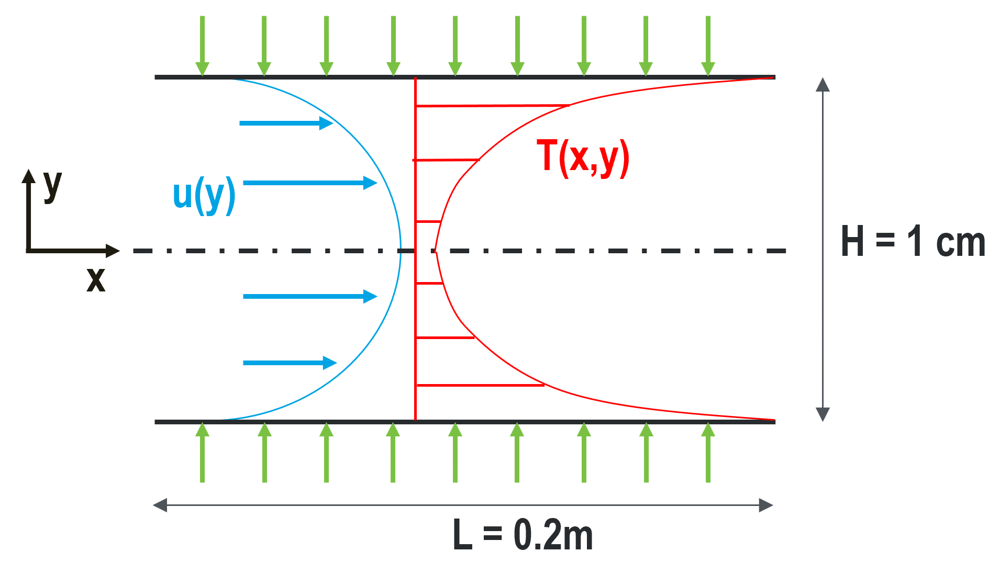
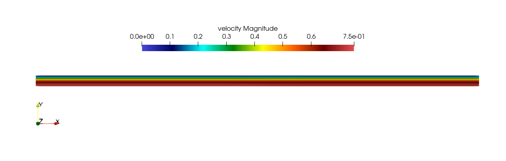
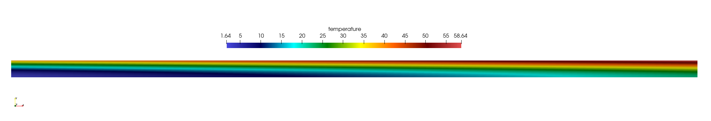
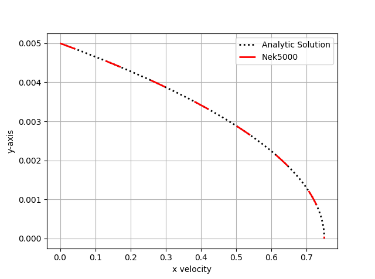
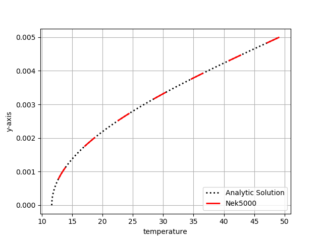

.. _fdlf:

Fully Developed Laminar Flow
============================

In this tutorial we will be building a case that involves incompressible laminar flow in a channel with a constant heat flux applied.
This case uses air as a working fluid and will be simulated using fully dimensional quantities.
A diagram of the case is provided in :numref:`fig:setup` and the necessary case parameters are provided in :numref:`tab:setup`.
Note that round numbers have been selected for the fluid properties and simulation parameters for the sake of simplicity.

.. _fig:setup:

   Diagram describing the case setup for fully developed laminar flow in a channel.

.. _tab:setup:

.. csv-table:: Fluid properties and simulation parameters
   :align: center
   :header: "Parameter name","variable","value"
   :widths: 15, 15, 15

   "channel height",":math:`H`","1 cm"
   "channel length",":math:`L`","20 cm"
   "mean velocity",":math:`U_m`","0.5 m/s"
   "heat flux",":math:`q''`","300 W/m\ :sup:`2`"
   "inlet temperature",":math:`T_{in}`","10 C"
   "density",":math:`\rho`","1.2 kg/m\ :sup:`3`"
   "viscosity",":math:`\mu`","0.00002 kg/m-s"
   "thermal conductivity",":math:`\lambda`","0.025 W/m-K"
   "specific heat",":math:`c_p`","1000 J/kg-K"

This case has analytic solutions to the momentum and energy equations which makes it easy to confirm if the problem is setup correctly.
These expressions will be used to test the accuracy of the solution.

.. math::
   :label: fdlf_vel

   u(y) = \frac{3}{2} U_m \left( 1 - 4\left(\frac{y}{H}\right)^2\right)

.. math::
   :label: fdlf_temp

   T(x,y)-T_b(x) = \frac{q'' H}{2\lambda}\left( 3\left(\frac{y}{H}\right)^2 - 2\left(\frac{y}{H}\right)^4-\frac{39}{280}\right)

where the bulk temperature is given by the expression

.. math::

   T_b(x) = \left(\frac{2q''}{U_m \rho c_p H}\right)x + T_{in}

.. Additionally, we will extract the predicted Darcy friction factor and Nusselt number from the simulation and confirm that they match the expected values.

.. .. math::

   f = \frac{96}{Re}

.. .. math::

   Nu = \frac{140}{17}

Before You Begin
________________

This tutorial assumes that you have installed *NekRS* in your home directory and 
have setup your :ref:`PATH <nekrs_home>`. You can either follow the example 
with the files in the fdlf directory within examples directory of nekRS, or create 
it within a directory of your choice.

If you have chosen to create the example as following along, you will need to 
compile the two *Nek5000* tools ``genbox`` for the initial mesh generation and 
``visnek`` to visualise the final result. Please follow the instructions in the
:ref:`Building the Nek5000 Tool Scripts <scripts>` section.

Mesh Generation
_______________

This tutorial uses a simple rectangular box mesh generated by ``genbox``. 
To create the input file, copy the following script and save the file as ``fdlf.box``.

.. literalinclude:: ../../../examples/fdlf/fdlf.box
   :language: none

For this mesh we are specifying 50 uniform elements in the stream-wise (:math:`x`) 
direction and 5 uniform elements in the span-wise (:math:`y`) direction. The 
velocity boundary conditions in the x-direction are a standard Dirichlet 
velocity boundary condition at :math:`x_{min}` and an open boundary condition 
with zero pressure at :math:`x_{max}`. The velocity boundary conditions in the 
y-direction are a symmetric boundary at :math:`y_{min}` and a wall with no slip
condition at :math:`y_{max}`. The temperature boundary conditions in the 
x-direction are a standard Dirichlet boundary condition at :math:`x_{min}`
and an outflow condition with zero gradient at :math:`x_{max}`. The temperature
boundary conditions in the y-direction are an insulated condition with zero
gradient at :math:`y_{min}` and a constant heat flux at :math:`y_{max}`. Note 
that the boundary conditions specified with lower case letters must have values
assigned in userbc, which will be shown later in this tutorial. Now we can run
``genbox`` with

.. code-block:: console

   $ genbox

When prompted provide the input file name, which for this case is ``fdlf.box``.
The tool will produce binary mesh and boundary data file ``box.re2`` which should 
be renamed to ``fdlf.re2``.

.. code-block:: console

   $ mv box.re fdlf.re2

.. Once we have the mesh file, we need to run the domain partitioning tool, ``genmap``.

.. .. code-block:: console

..    $ genmap

.. On input specify ``fdlf`` as your casename and press enter to use the default tolerance. 
.. This step will produce ``fdlf.ma2`` which contains the element partitioning information.
.. You do not have to specify the number of MPI-ranks you plan to run the case with when you use ``genmap``, as it contains the partitioning for all possible choices.

.. :tip: If either ``genbox`` or ``genmap`` cannot be located by your shell, check to make sure the ``Nek5000/tools`` directory is in your path. For help see :ref:`here<sec:PATH>`.
.. tip:: If ``genbox`` cannot be located by your shell, check to make sure the ``Nek5000/tools`` directory is in your path. For help see `here <https://nek5000.github.io/NekDoc/quickstart.html#sec-path>`_.

Control parameters
__________________

The control parameters for any case are given in the ``.par`` file. For this case,
create a new file called ``fdlf.par`` with the following:

.. literalinclude:: ../../../examples/fdlf/fdlf.par

For this case the properties evaluated are for air at ~20 C. 
Note that ``rhoCp`` is the product of density and specific heat.
The ``CASEDATA`` list represents an easy way of passing data to *NekRS* that
can later be used throughout the ``.udf`` file. Additionally, like all values
specified in the ``.par`` file, they can be changed without the need to recompile *NekRS*.

The required values for the initial and boundary conditions specified by lower 
case letters in the  ``.box`` file are defined here as a list of user given
parameters, as well as the height of the channel. These initial and boundary
conditions will later be called in respective subroutines of the ``.udf`` file.

User-Defined Host Functions File (.udf)
_______________________________________

The user-defined host functions file implements various subroutines to allow the
user to interact with the solver. For more information on the ``.udf`` file and 
the available subroutines see :ref:`here <udf_functions>`.

Boundary and initial conditions
^^^^^^^^^^^^^^^^^^^^^^^^^^^^^^^

The boundary conditions can be setup in function ``UDF_Setup`` as shown below, 
where the highlighted lines indicate where the actual boundary condition is specified.
The velocity and temperature are set to the analytic profiles given by Eqs. :
eq:`fdlf_vel` and :eq:`fdlf_temp` and the heat flux is set to a constant value.

.. literalinclude:: ../../../examples/fdlf/fdlf.udf
   :language: c++
   :lines: 41-61
   :emphasize-lines: 3-5,12-15,20

*The channel height, mean velocity, heat flux, and mean inlet temperature are all 
called from the list of user defined parameters in the ``.par`` file.
The thermal conductivity is set from the :ref:`field coefficient array<tab:cpfld>`, 
which is set from the conductivity specified for the temperature field in the ``.par`` file.*

The next step is to specify the initial conditions.
This can also be done in the ``UDF_Setup`` function as shown. 
Again, the actual inlet condition is specified with the highlighted lines.

.. literalinclude:: ../../../examples/fdlf/fdlf.udf
   :language: c++
   :lines: 117-132
   :emphasize-lines: 12,16

As with the boundary conditions, the inlet temperature and mean velocity are set
from the list of user defined parameters in the ``.par`` file. 

Running the case
________________

You should now be all set to run your case! As a final check, you should have the following files:

 * :download:`fdlf.re2 <../../../examples/fdlf/fdlf.re2>`
 * :download:`fdlf.par <../../../examples/fdlf/fdlf.par>`
 * :download:`fdlf.udf <../../../examples/fdlf/fdlf.udf>`
 * :download:`fdlf.usr <../../../examples/fdlf/fdlf.usr>`

If for some reason you encountered an insurmountable error and were unable to 
generate any of the required files, you may use the provided links to download them. 
Now you can run the case

.. code-block:: console

   $ mpirun -np 4 nekrs --setup fdlf.par | tee logfile

To launch an MPI jobs on your local machine using 4 ranks. The output will be 
redirected to ``logfile``.

Post-processing the results
___________________________

Once execution is completed your directory should now contain 5 checkpoint files 
that look like this:

.. code-block:: none

   fdlf0.f00001
   fdlf0.f00002
   ...

The preferred mode for data visualization and analysis with *NekRS* is to use
Visit or ParaView. One can use the script *visnek*, to be found in ``/scripts``. 
It is sufficient to run:

.. code-block:: console

   $ visnek fdlf

to obtain a file named ``fdlf.nek5000`` which can be recognized in Visit/ParaView. 
In the viewing window one can visualize the flow-field as depicted in 
:numref:`fig:velocity_paraview` as well as the temperature profile as depicted 
in :numref:`fig:temperature_paraview` below.

.. _fig:velocity_paraview:

   Steady-State flow field visualized in Visit/ParaView. Colors represent velocity magnitude.

.. _fig:temperature_paraview:

   Temperature profile visualized in Visit/ParaView.

Plots of the velocity and temperature varying along the y-axis as evaluated by *Nek5000* compared to the analytic solutions provided by Eqs. :eq:`fdlf_vel` and :eq:`fdlf_temp` respectively are shown below in :numref:`fig:velocity_lineplot` and :numref:`fig:temperature_lineplot`.

.. _fig:velocity_lineplot:

   *Nek5000* velocity solutions plotted against analytical solutions.

.. _fig:temperature_lineplot:

   *Nek5000* temperature solutions plotted against analytical solutions.
